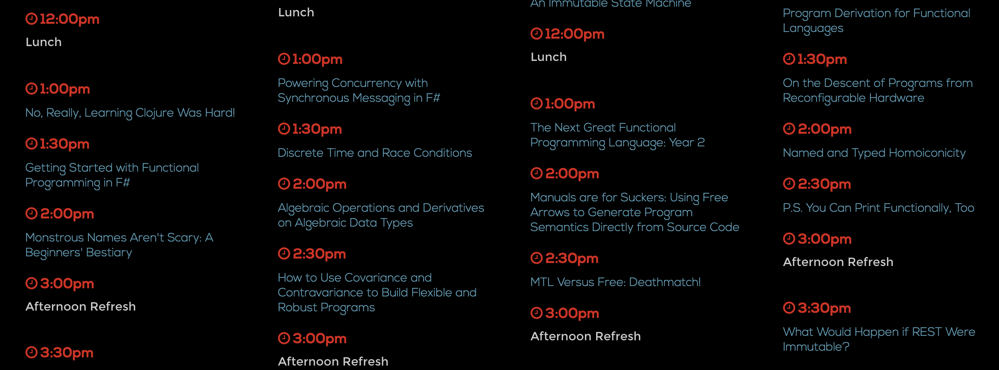
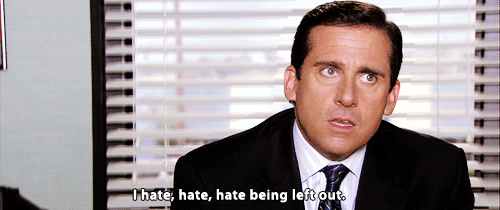
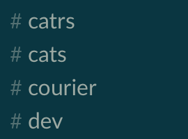
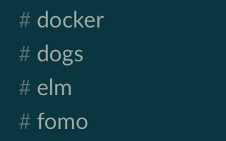
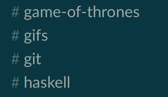
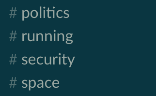
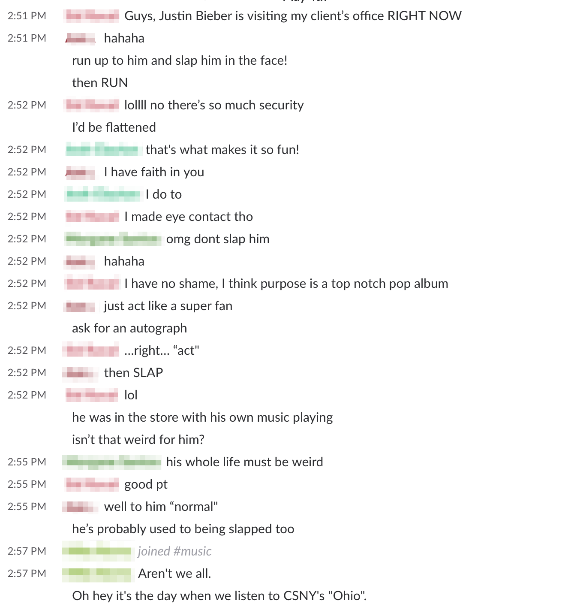

## Conquering Your Fear Of Missing Out

^ Hi Everyone! My name is Tony and I'm here today to talk to you about conquering your fear of missing out.
^ First let's start of with a definition.

---

# What is FOMO?

^ FOMO or Fear of Missing Out is the feeling of anxiety that an interesting or exciting event is currently happening somewhere else.
^ This is usually intensified from seeing social media posts about that somewhere else.

---

^ With all the social media happening now-a-days on Facebook, Twitter, Instagram, you name it, we've fallen into this addiction of always needing to check them to make sure we're not missing out!
^ This can take away from our in-the-moment experiences or even productivity. Let's look at some examples.

---

# FOMO is...

^ FOMO can be that feeling you get when you see selfies of all your friends hanging out without you.
^ Here is a recent picture of all my high school friends hanging out at a reunion without me.

---

# FOMO is...

^ FOMO can be that feeling you get when you're missing out on a really great conference.
^ Like this one! Lambdaconf
^ If you have friends or co-workers who aren't here, they might be feeling FOMO.

---

# FOMO is...

^ Or maybe you're at a conference, like this one, and there are good talks in the same time slots in different tracks.
^ You can't be in all of them. You can only pick one! Which to choose?!

---

## FOMO at the office.

^ FOMO can also happen at the office.
^ If you're like Michael Scott and hate, hate, hate being left out, you probably get FOMO.
^ How can FOMO happen at the office?

---

# Slack

^ At thoughtbot, we use Slack for team chat and we currently have over 380 channels.
^ Here are a few that I like to hangout in, but there are more good ones!
^ It's impractical to sit in all the ones I like, but I have too much FOMO wondering if I'm missing out on a good conversation.

---

^ I can't handle it.
^ I can't handle being in all the rooms and I can't handle not being in all the rooms!
^ So what could I possibly do?

---

## Introducing FOMObot!

^ So I created FOMObot.
^ FOMObot is a Slack bot written in Haskell to help you manage your FOMO.
^ FOMObot sits in every channel for you.
^ It watches for increased chatter.
^ It alerts you that you may be missing out
^ Then you can visit the channel and join in!

---

^ Here is a real example when a coworker saw Justin Bieber in real life. The music channel
exploded with activity and fomobot reported it! The event happened at 2:51 and by 2:52 there was enough
activity to trigger fomobot.

---

## BOOM! FOMO Solved!

^ Now with FOMObot, your FOMO issues are solved!

---

## [fit] github.com/thoughtbot/FOMObot

^ FOMObot is Open Source so check it out on Github!
^ Set it up for your team and help make it better!

---

# Thanks!

## [fit] _Tony DiPasquale_ - _thoughtbot_

### @tonyd256

^ Thanks everyone! My name is Tony and I work for thoughtbot! Check me out on twitter!
